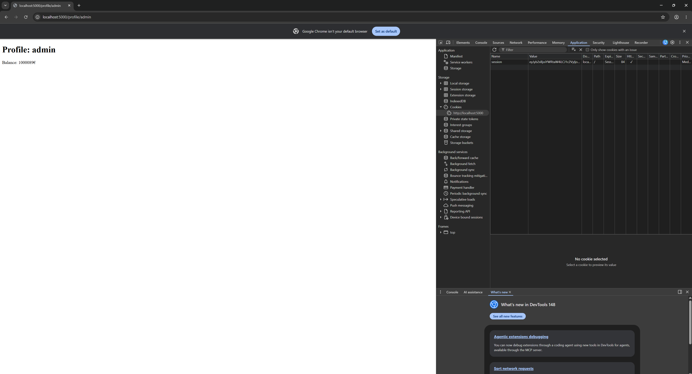
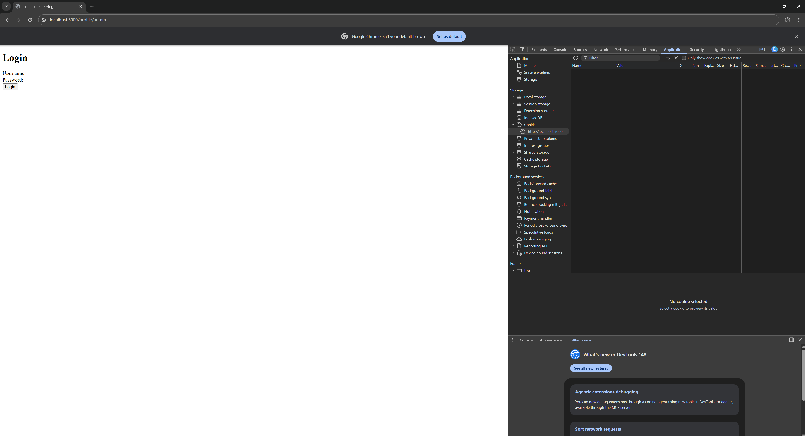
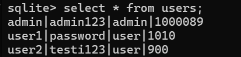
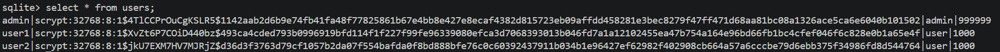
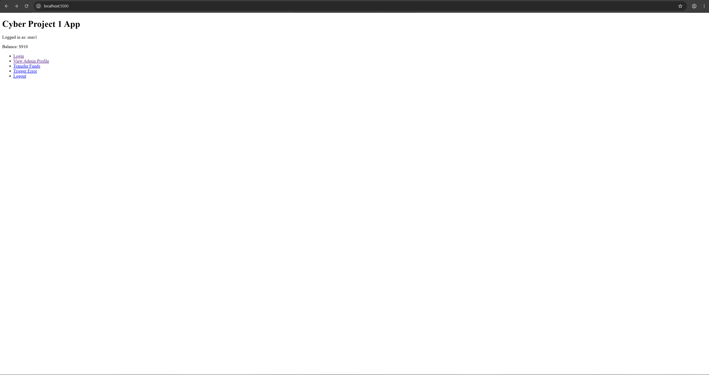
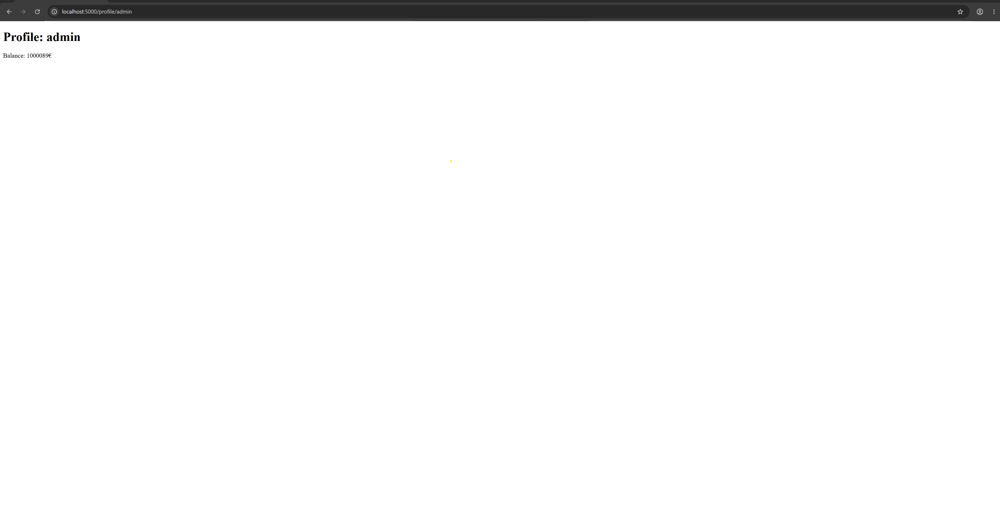
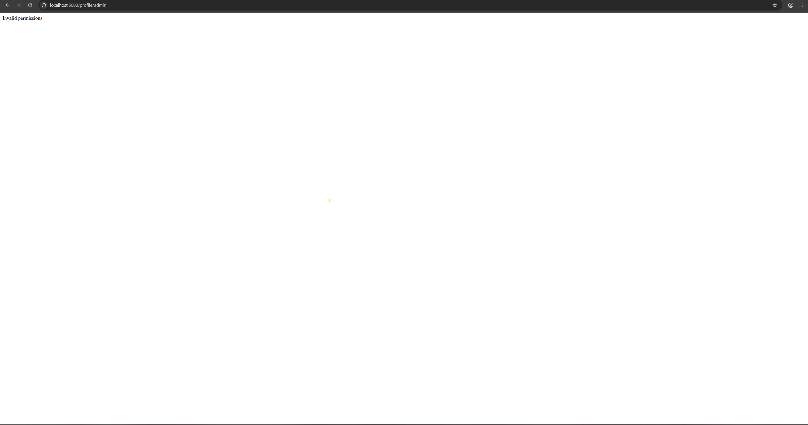
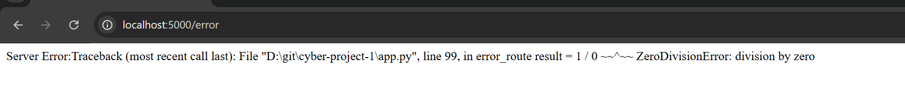
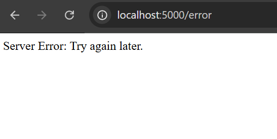

# Cyber Security Base: COurse Project I (TKT200093) Report

## Description
This report was written for the CSB Project I course at the University of Helsinki. It covers five common web application security flaws: one CSRF vulnerability, included due to its fundamental nature, and four vulnerabilities from the OWASP Top 10 2025 list. The application follows the structure taught in the TKT20019 – Databases and Web Programming course, and the vulnerabilities were implemented as real flaws in the project using the Python Flask library.
<br>
Flaws implemented:
- Flaw 1 A07:2025 Authentication Failures
- Flaw 2 A04:2025 Cryptographic Failures
- Flaw 3 A01:2025 Broken Access Control
- Flaw 4 Missing CSRF
- Flaw 5 A10:2025 Mishanding Exceptional Conditions
<br>
GitHub repository: https://github.com/koenol/cyber-project-1

## Installation
This guide can also be found in the github repository.
<br>
Prerequisites:
- Python 3.14
- Pip 25.3
<br>
Create and activate a virtual environment
```
python -m venv venv
```

```
Activate (Linux):
$ source venv/bin/activate

Activate (Windows):
$ venv\Scripts\activate
```

Install Dependencies
```
pip install -r requirements.txt
```

## Flaws

Flaw 1: A07:2025 Authentication Failures
Location: app.py:7-8
Desc: A hardcoded weak secret key ("secretkey") is used for session management and is exposed in the public repository. This allows attackers to forge session cookies and impersonate any user without knowing their password. Proper secret key management requires generating strong random keys and storing them in environment variables or secure configuration systems.

Fix: app.py:10-13
Fix Desc: Generate a cryptographically strong random secret key, for e.g. using os.urandom(32), and store it in an environment variable (e.g., SECRET_KEY). Load it dynamically at runtime using os.environ.get() instead of hardcoding it in the source code. This prevents the secret key from being exposed in the repository and makes it unique.

Screenshot of the flaw effects:


Screenshots demonstrate how attacker can edit/set session role when secret key is known. If the user does not have valid active session the user will be directed to login page instead.


Flaw 2: A04:2025 Cryptographic Failures
Location: db.py:18
Desc: Passwords are stored in plain text in the database without any hashing or encryption. Additionally there are no rate-limiting mechanisms for login attemps, enababling attackers to potentially perform brute-force attacks to crack user passwords. Passwords should be hashed using strong algorithms and login attempts should be rate-limited to prevent automated attacks.

Fix: Use password hashing library and implement login attempt rate limiting
Fix Desc: Implement password hashing using werkzeug.security or a similar algorithm during user registration and password updates. When verifying passwords during login use werkzeug.security to compare the user input against the hashed password. Additionally, implement rate limiting on the login endpoint by tracking failed login attempts per IP and temporary block users after a threshold, e.g. 5 failed attemps, is reached within set timelimit.




Flaw 3: A01:2025 Broken Access Control
Location: app.py:46-47
Desc: The profile endpoint only checks if a user is logged in, but does not verify that the user has permission to view the requested profile. This allows any authenticated user to access any other user's profile and view sensitive information like their account balance. Proper access control requires verifying that the requested resource belongs to the current user.

Fix: app.py:49-51
Fix Desc: Add an authorization check in the profile() function to verify that session.get("user") equals the requested username parameter. If they don't match, return a 403 error with an appropriate error message. This ensures users can only view their own profile unless they have special admin privileges explicitly granted in the access control logic.
<br>
Screenshots of the flaw effects:



Flaw 4: Missing CSRF (Cross-Site Request Forgery)
Location: app.py:58-65
Desc: The application lacks CSRF token generation and validation on e.g. money transfers. An attacker can craft a malicious webpage that, when visited by a logged-in user, will automatically submit a transfer request on their behalf without their knowledge. CSRF tokens ensure that form submissions originate from the legitimate website and not from external sources.

Fix: app.py:66-69 and transfer.html:7
Fix Desc: Initialize Flask-WTF's CSRFProtect at the start of the application with csrf = CSRFProtect(app). In the transfer() function, validate the CSRF token from the form submission using validate_csrf(). In the frontend template (transfer.html), include a hidden input field containing the CSRF token generated by {{ csrf_token() }}. This ensures that transfer requests can only originate from forms served by legit website.

Screenshots are not applicable here. Website does not use CSRF so if user e.g. mistyped domain address and visited fake website, the transfer function would be transferring balance to someone completely else from the users balance.

Flaw 5: A10:2025 Mishandling Exceptional Conditions
Fix: app.py:93-95
Desc: The error handler exposes sensitive information by returning detailed stack traces (via traceback.format_exc()) to users. This reveals the internal structure, file paths, and code logic of the servers backend, which attackers can use to identify vulnerabilities and exploit them by doing targeted attacks. Error messages should be generic for end users while detailed logs are kept server-side for administrators.
<br>
Screenshots of the flaw effects:


Location: app.py:84-91
Fix Desc: Replace the detailed traceback output with a generic error message for user-facing responses (e.g., "Server Error: Please try again later."). Log the full traceback server-side instead so that only administrators can debug issues without exposing sensitive details to users. Also ensure that debug mode is disabled in production (debug=False when running the app).